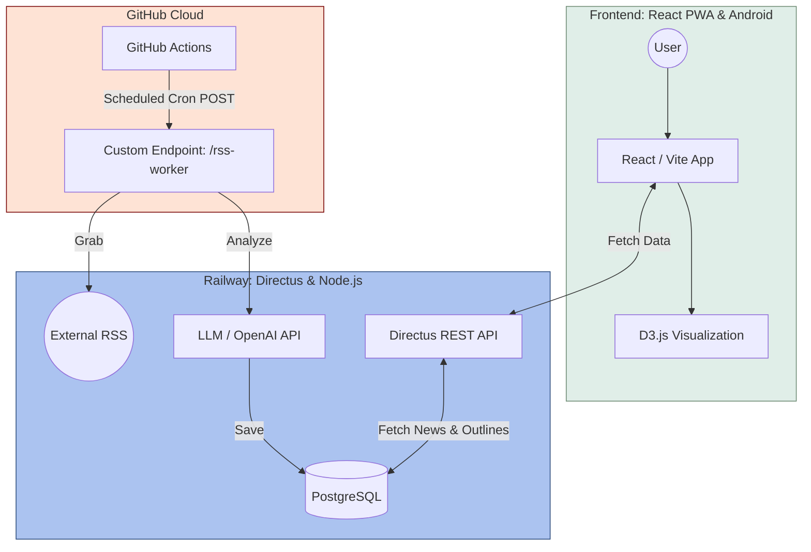

# What-If: AI Sci-Fi Inspiration & Outlining Tool

> A full-stack creative tool that transforms real-world tech news into science fiction story seeds using AI.

https://github.com/user-attachments/assets/9f36fa6c-9327-42c2-bdb7-6550932aa29d

## ⚡ Key Features

### AI-Powered Inspiration Engine

**Automated Content Curation**: Leverages GitHub Actions to trigger a daily backend sync, fetching the latest tech news via RSS.

**Intelligent Synthesis**: Integrated with LLM APIs to analyze raw articles and extract "Sci-Fi Seeds"—unique plot hooks and speculative concepts based on real-world emerging tech.

### Frictionless Authentication

**PIN-Code Login**: Replaced traditional email/password complexity with a lightweight PIN verification system, optimizing the user experience for mobile creators and PWA environments.

**Secure Access**: Implemented stateless authentication logic to ensure security without compromising the "instant-access" feel of a creative tool.

### Advanced Interactive UI

**D3.js Data Visualization**: Developed a custom D3.js-powered chart to represent story structure. It provides a bird's-eye view of chapter distribution and narrative weight.

**Draggable Story Outlining**: Built a highly responsive Drag-and-Drop (DnD) interface, allowing writers to reorder story arcs and chapters intuitively, with real-time database synchronization.

## 🏗️ Technical Architecture

## 📈 Technical Stack Summary

LayerTechnologyFrontend : React, Vite, PWA, Capacitor (Android), D3.js

Backend : Directus (Headless CMS), Node.js

Automation : GitHub Actions (Cron Jobs)

AI : OpenAI / LLM Integration

Deployment : Vercel (Frontend), Railway (Backend & PostgreSQL)

## 📱 Installation & Demo

Live Demo: https://whatif42.vercel.app/

Android App: Download the latest APK from the [Releases page](https://github.com/yilizzz/outliner/releases).

