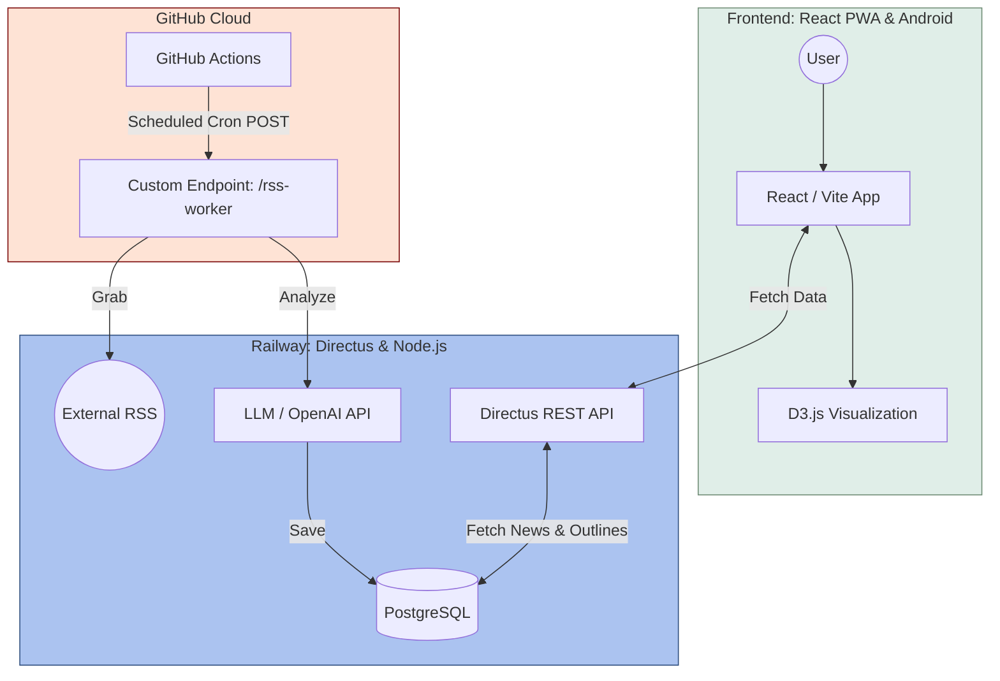

# What-If: AI Sci-Fi Inspiration & Outlining Tool

> A full-stack creative tool that transforms real-world tech news into science fiction story seeds using AI.

  <video src="https://github.com/user-attachments/assets/9f36fa6c-9327-42c2-bdb7-6550932aa29d" 
         autoplay 
         loop 
         muted 
         playsinline 
         controls 
         width="400px">
  </video>

## ⚡ Key Features

### AI-Powered Inspiration Engine

**Automated Content Curation**: Leverages GitHub Actions to trigger a daily backend sync, fetching the latest tech news via RSS.

**Intelligent Synthesis**: Integrated with LLM APIs to analyze raw articles and extract "Sci-Fi Seeds"—unique plot hooks and speculative concepts based on real-world emerging tech.

### Frictionless Authentication

**PIN-Code Login**: Replaced traditional email/password complexity with a lightweight PIN verification system, optimizing the user experience for mobile creators and PWA environments.

**Secure Access**: Implemented stateless authentication logic to ensure security without compromising the "instant-access" feel of a creative tool.

### Advanced Interactive UI

**D3.js Data Visualization**: Developed a custom D3.js-powered chart to represent story structure. It provides a bird's-eye view of chapter distribution and narrative weight.

**Draggable Story Outlining**: Built a highly responsive Drag-and-Drop (DnD) interface, allowing writers to reorder story arcs and chapters intuitively, with real-time database synchronization.

## 🏗️ Technical Architecture

## 📈 Technical Stack Summary

LayerTechnologyFrontend : React, Vite, PWA, Capacitor (Android), D3.js

Backend : Directus (Headless CMS), Node.js

Automation : GitHub Actions (Cron Jobs)

AI : OpenAI / LLM Integration

Deployment : Vercel (Frontend), Railway (Backend & PostgreSQL)

## 📱 Installation & Usage

### 🌐 Web App (PWA)

**Live Demo**: https://whatif42.vercel.app/

This app is built as a **Progressive Web App (PWA)**, which means you can install it directly to your device for a native app-like experience:

#### 📲 Install on Mobile (iOS/Android)

1. Open https://whatif42.vercel.app/ in your mobile browser (Safari for iOS, Chrome for Android)
2. **On iOS**: Tap the Share button → Select "Add to Home Screen"
3. **On Android**: Tap the menu (⋮) → Select "Install app" or "Add to Home Screen"
4. The app icon will appear on your home screen with full-screen support

#### 💻 Install on Desktop (Chrome/Edge)

1. Visit https://whatif42.vercel.app/ in Chrome or Edge
2. Look for the **install icon** (⊕) in the address bar
3. Click "Install" to add the app to your desktop
4. Launch from Start Menu (Windows) or Applications (Mac)

### ✨ PWA Benefits

- **Offline Support**: Access your stories even without internet connection
- **Fast Loading**: Cached resources for instant startup
- **Native Feel**: Full-screen experience without browser UI
- **Auto Updates**: Always get the latest features seamlessly
- **Cross-Platform**: One app works on iOS, Android, Windows, Mac, and Linux
